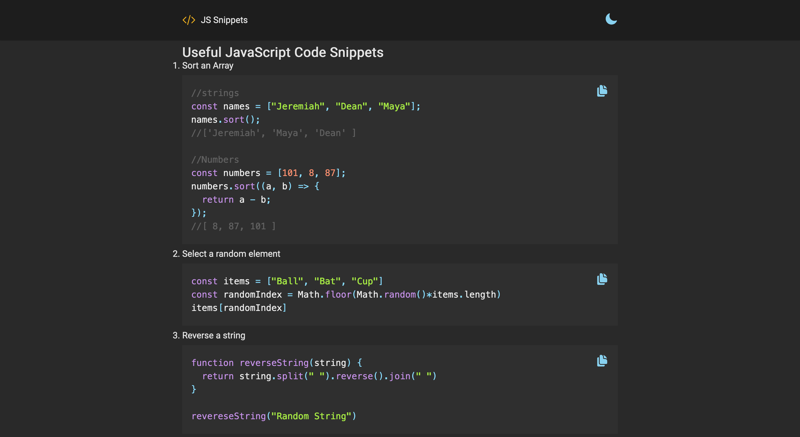

### Markdown-blog

## Available Scripts

In the project directory, you can run:

### `pnpm install`

Instal All dependencies in this project

### `pnpm dev`

Runs the app in the development mode. 
Open [http://localhost:3000](http://localhost:3000) to view it in the browser.

### Link

- React Syntax Highlighter: https://www.npmjs.com/package/react-syntax-highlighter
- React Copy To Clipboard: https://github.com/nkbt/react-copy-to-clipboard
- Markdown To Jsx: https://www.npmjs.com/package/markdown-to-jsx
- Heroicons: https://heroicons.com/

